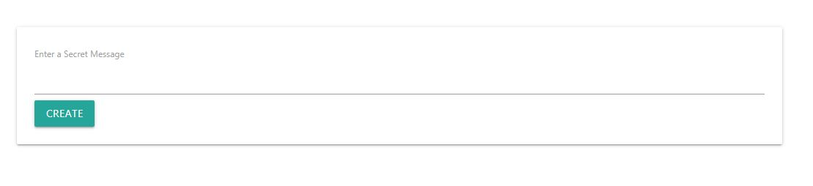
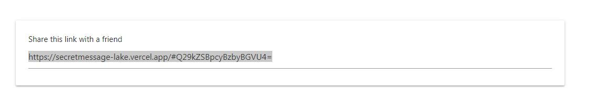
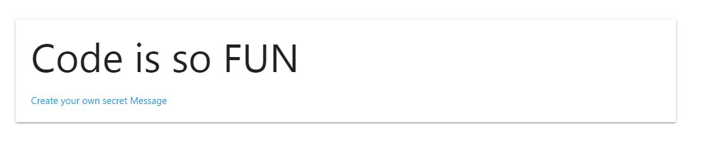

# Secret Message with JS

An application to share secret message. [App](https://secretmessage-lake.vercel.app/).

Yo just have to share a link to share the secret message to you friend...

Step1:

Step2:

Step3:

##### In this project I learn about:
* Encrypting information with Base64 and ASCII 
* Use atob() and btoa() Methods.
* Materialize CSS
* Host the project on Vercel

Check the simple app clicking [here](https://secretmessage-lake.vercel.app/).

